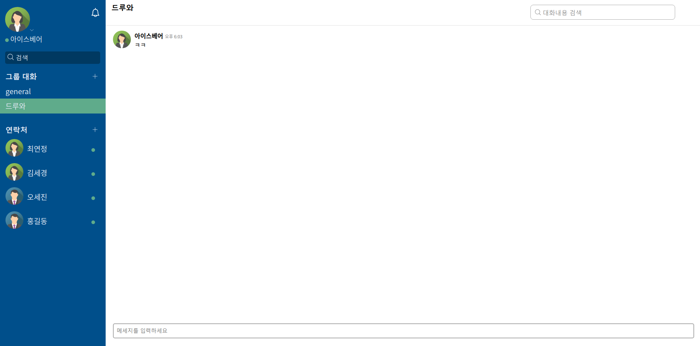

## 네이버 HACKDAY 지원서를 보시고 오셨다면 제발 봐주세요 ㅠㅠ
## 1~3지망에 뭘 지망하는지 주제를 정작 빠뜨리고 제출해서 혹시나하는 마음에 여기에다가라도 써서 전달드립니다...
- 1지망 : 27. 웹소켓을 사용한 실시간 웹툰 퀴즈 대결
- 2지망 : 28. “훗, 네 그림실력이면 내가 이긴다” spring-boot 기반 공모전 페이지 개발
- 3지망 : 4. 밴드 OpenAPI를 이용한 신규 그룹 커뮤니케이션 서비스 개발

# TOKTALK

## 소개
- 웹소켓 기반 SPA 메신저 서비스

## 데모사이트
http://ec2-13-124-151-134.ap-northeast-2.compute.amazonaws.com

## 기술스택
- Spring Boot 2.0
- JPA
- Maven
- Spring Security
- Oauth
- RabbitMQ
- Redis
- React.js
- Sockjs
- Thymeleaf
- AWS
- NginX
- Docker
- Docker Swarm

## 미리보기

